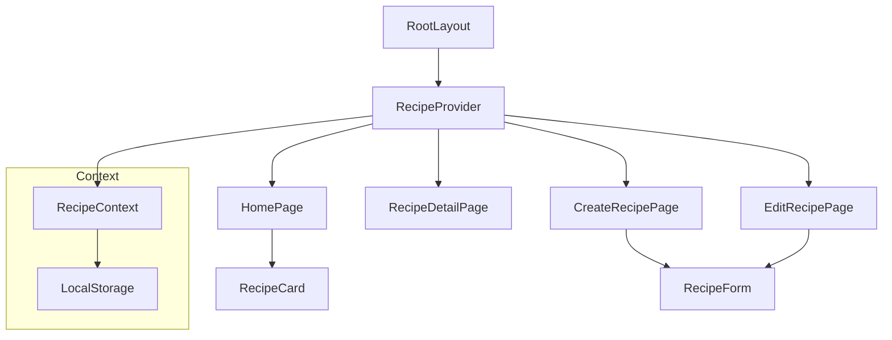
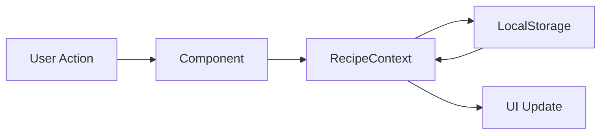
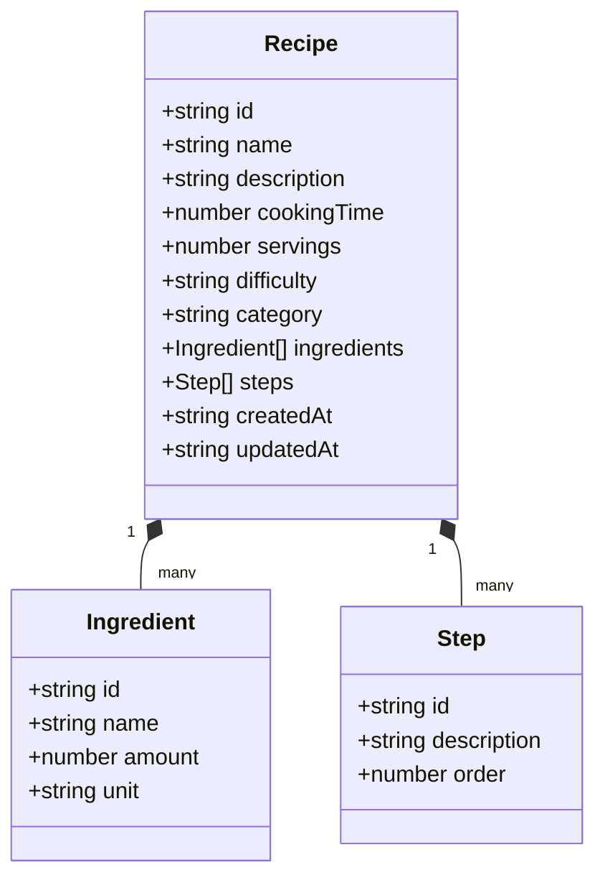

# Recipe Manager Application Architecture

This document outlines the architecture of the Recipe Manager application.

## Component Structure



## Data Flow



## File Structure

```
recipe-manager/
├── app/
│   ├── components/
│   │   ├── RecipeCard.tsx    # Recipe card component for list view
│   │   └── RecipeForm.tsx    # Form component for create/edit
│   │   
│   ├── context/
│   │   └── RecipeContext.tsx # State management
│   │   
│   ├── recipes/
│   │   ├── [id]/
│   │   │   └── page.tsx      # Recipe detail page
│   │   ├── create/
│   │   │   └── page.tsx      # Create recipe page
│   │   └── edit/
│   │       └── [id]/
│   │           └── page.tsx   # Edit recipe page
│   │   
│   ├── types/
│   │   └── recipe.ts         # TypeScript type definitions
│   │   
│   ├── layout.tsx            # Root layout with provider
│   │   
│   ├── page.tsx              # Home page with recipe list
│   └── globals.css           # Global styles
└── ARCHITECTURE.md           # This file
```

## Component Descriptions

### Core Components

1. **RootLayout (`app/layout.tsx`)**
   - Root layout component
   - Wraps the application with RecipeProvider
   - Applies global styles and fonts

2. **RecipeProvider (`app/context/RecipeContext.tsx`)**
   - Manages global recipe state
   - Handles CRUD operations
   - Persists data to localStorage
   - Provides context to child components

3. **RecipeForm (`app/components/RecipeForm.tsx`)**
   - Reusable form component
   - Handles both creation and editing of recipes
   - Manages form state and validation
   - Handles ingredient and step management

4. **RecipeCard (`app/components/RecipeCard.tsx`)**
   - Displays recipe preview in list view
   - Handles recipe deletion
   - Provides navigation to detail/edit views

### Pages

1. **HomePage (`app/page.tsx`)**
   - Displays list of recipes
   - Handles empty state
   - Provides navigation to create new recipe

2. **RecipeDetailPage (`app/recipes/[id]/page.tsx`)**
   - Shows full recipe details
   - Handles recipe deletion
   - Provides navigation to edit view

3. **CreateRecipePage (`app/recipes/create/page.tsx`)**
   - Uses RecipeForm for new recipe creation
   - Handles form submission
   - Redirects after successful creation

4. **EditRecipePage (`app/recipes/edit/[id]/page.tsx`)**
   - Uses RecipeForm for recipe editing
   - Pre-fills form with existing recipe data
   - Handles form submission and updates

## Data Model



## State Management

The application uses React Context for state management with the following features:

- Centralized state management through RecipeContext
- Local storage persistence
- CRUD operations for recipes
- Real-time UI updates

## Styling

The application uses:
- Tailwind CSS for styling
- Responsive design
- Consistent color scheme
- Semantic HTML structure 